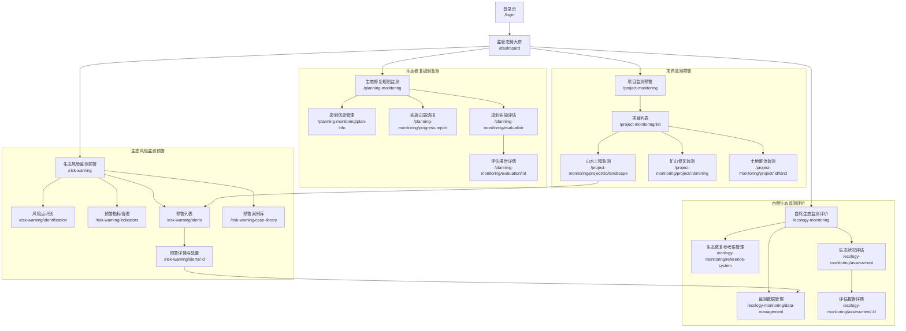

# User Flow — 生态保护修复监测评估预警平台

```mermaid
graph TD
  %% 主要入口页面
  Login["登录页<br/>/login"]
  Dashboard["监管态势大屏<br/>/dashboard"]

  Login --> Dashboard

  %% 核心业务功能模块
  Dashboard --> ModuleA["自然生态监测评价<br/>/ecology-monitoring"]
  Dashboard --> ModuleB["生态风险监测预警<br/>/risk-warning"]
  Dashboard --> ModuleC["生态修复规划监测<br/>/planning-monitoring"]
  Dashboard --> ModuleD["项目监测预警<br/>/project-monitoring"]

  %% 自然生态监测评价子页面
  subgraph "自然生态监测评价"
    ModuleA --> PageA1["生态修复参考系管理<br/>/ecology-monitoring/reference-system"]
    ModuleA --> PageA2["监测数据管理<br/>/ecology-monitoring/data-management"]
    ModuleA --> PageA3["生态状况评估<br/>/ecology-monitoring/assessment"]
    PageA3 --> PageA3_1["评估报告详情<br/>/ecology-monitoring/assessment/:id"]
  end

  %% 生态风险监测预警子页面
  subgraph "生态风险监测预警"
    ModuleB --> PageB1["风险点识别<br/>/risk-warning/identification"]
    ModuleB --> PageB2["预警指标管理<br/>/risk-warning/indicators"]
    ModuleB --> PageB3["预警列表<br/>/risk-warning/alerts"]
    PageB3 --> PageB3_1["预警详情与处置<br/>/risk-warning/alerts/:id"]
    ModuleB --> PageB4["预警案例库<br/>/risk-warning/case-library"]
  end

  %% 生态修复规划监测子页面
  subgraph "生态修复规划监测"
    ModuleC --> PageC1["规划信息管理<br/>/planning-monitoring/plan-info"]
    ModuleC --> PageC2["实施进展填报<br/>/planning-monitoring/progress-report"]
    ModuleC --> PageC3["规划实施评估<br/>/planning-monitoring/evaluation"]
    PageC3 --> PageC3_1["评估报告详情<br/>/planning-monitoring/evaluation/:id"]
  end

  %% 项目监测预警子页面
  subgraph "项目监测预警"
    ModuleD --> PageD1["项目列表<br/>/project-monitoring/list"]
    PageD1 --> PageD1_1["山水工程监测<br/>/project-monitoring/project/:id/landscape"]
    PageD1 --> PageD1_2["矿山修复监测<br/>/project-monitoring/project/:id/mining"]
    PageD1 --> PageD1_3["土地整治监测<br/>/project-monitoring/project/:id/land"]
  end

  %% 跨模块导航
  PageB3_1 --> PageA2
  PageD1_1 --> PageB3
```
